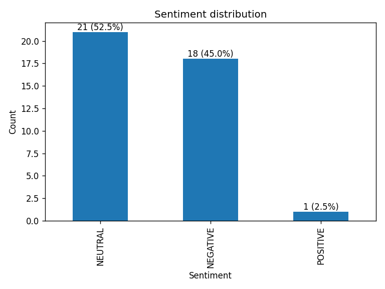

# Oktoberfest AI


News/RSS sentiment analyzer using HuggingFace Transformers.  
Fetches headlines (DW, Tagesschau, Google News keywords), runs sentiment,
exports CSV/JSON/Excel, and plots a chart.



---

## Quickstart (Windows PowerShell)

```powershell
python -m venv .venv
. .\.venv\Scripts\Activate.ps1
pip install -r requirements.txt

# German news with Oktoberfest focus
python oktoberfest_analyzer.py --source news --limit 120 --keywords Oktoberfest Wiesn --lang de
Examples
powershell
Copy code
# Sample mode (offline)
python oktoberfest_analyzer.py --source sample

# Custom feeds + model + output dir
python oktoberfest_analyzer.py --source news --limit 80 `
  --feeds https://rss.dw.com/rdf/rss-en-all https://www.tagesschau.de/xml/rss2 `
  --model cardiffnlp/twitter-xlm-roberta-base-sentiment `
  --outdir out-custom
Structure
oktoberfest_analyzer.py  main script

postprocess.py  Excel auto-width + bar chart with percentages

.github/workflows/python.yml  CI smoke test

requirements.txt  dependencies

assets/  screenshots & charts

License
MIT  2025 kyan9400
