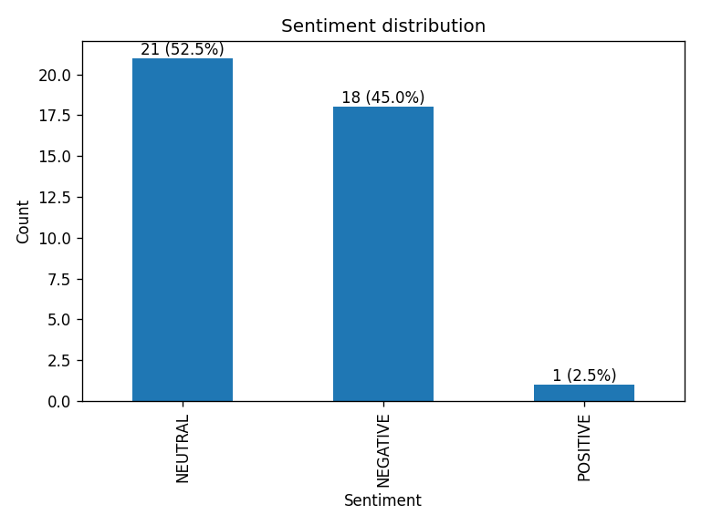

# Oktoberfest AI


News/RSS sentiment analyzer using HuggingFace Transformers.
Fetches headlines (DW, Tagesschau, Google News keyword search), runs a sentiment
model over them, exports CSV/JSON/Excel, and plots a distribution chart.



---

## How it works

1. `oktoberfest_analyzer.py` builds a feed list: any `--feeds` you pass, a Google News
   RSS search for your `--keywords` (in the `--lang` locale), plus the DW and Tagesschau
   feeds unless they are already present.
2. Titles and summaries are pulled with `feedparser`, HTML-stripped, de-duplicated and
   capped at `--limit` items.
3. A `transformers` sentiment pipeline (default:
   `cardiffnlp/twitter-xlm-roberta-base-sentiment`, multilingual) labels every item as
   `POSITIVE`, `NEGATIVE` or `NEUTRAL`. If the model fails to load, it falls back to
   `distilbert-base-uncased-finetuned-sst-2-english`.
4. Results are written to the output directory (see below) and a summary is printed.

## Requirements

- Python 3.11 (the CI and Docker image use 3.11; 3.10+ works)
- Dependencies in `requirements.txt`: pandas, matplotlib, feedparser, transformers,
  sentencepiece, protobuf, tiktoken, xlsxwriter, torch

The first run downloads the sentiment model from the HuggingFace Hub (roughly 1 GB for
the default model) into your HF cache.

## Quickstart

Windows PowerShell:

```powershell
python -m venv .venv
. .\.venv\Scripts\Activate.ps1
pip install -r requirements.txt

# German news with Oktoberfest focus
python oktoberfest_analyzer.py --source news --limit 120 --keywords Oktoberfest Wiesn --lang de

# Sample mode (four built-in sentences, no network needed except the model download)
python oktoberfest_analyzer.py --source sample
```

macOS / Linux:

```bash
python3 -m venv .venv
source .venv/bin/activate
# CPU-only PyTorch wheels keep the install small
pip install --extra-index-url https://download.pytorch.org/whl/cpu -r requirements.txt

python oktoberfest_analyzer.py --source news --limit 120 --keywords Oktoberfest Wiesn --lang de
```

Custom feeds, model and output directory:

```bash
python oktoberfest_analyzer.py --source news --limit 80 \
  --feeds https://rss.dw.com/rdf/rss-en-all https://www.tagesschau.de/xml/rss2 \
  --model cardiffnlp/twitter-xlm-roberta-base-sentiment \
  --outdir out-custom
```

## CLI options

| Option | Default | Description |
| --- | --- | --- |
| `--source {news,sample}` | `news` | Fetch live RSS items, or use the built-in sample sentences |
| `--limit N` | `60` | Maximum number of items to analyze |
| `--feeds URL ...` | – | Extra RSS/Atom feed URLs (DW and Tagesschau are added automatically) |
| `--keywords K ...` | – | Google News search keywords, e.g. `--keywords Oktoberfest Wiesn` |
| `--lang` | `de` | Locale for the Google News search (`hl`, `gl`, `ceid`) |
| `--model` | `cardiffnlp/twitter-xlm-roberta-base-sentiment` | Any HuggingFace sentiment-analysis model |
| `--outdir` | `out-YYYYMMDD-HHMMSS` | Output directory (created if missing) |

## Outputs

Everything is written to `--outdir`:

| File | Content |
| --- | --- |
| `analysis.csv` / `analysis.json` | One row per item: `Text`, `Sentiment`, `Score` |
| `analysis.xlsx` | Same table with auto-sized columns (via `xlsxwriter`) |
| `top_positive.csv` / `top_negative.csv` | Ten highest-scoring items per label (only if any exist) |
| `sentiment.png` | Bar chart of label counts with percentages |

## Run with Docker

Build the image (only needed once or after changes):

```bash
docker build -t kyan9400/oktoberfest-ai:latest .
```

Run it. The image's default command is
`--source sample --model oliverguhr/german-sentiment-bert`; any arguments you pass replace it:

```bash
# Built-in sample
docker run --rm kyan9400/oktoberfest-ai:latest

# Live news, keeping the results on the host
docker run --rm -v "$PWD/out:/app/out" kyan9400/oktoberfest-ai:latest \
  --source news --limit 80 --keywords Oktoberfest Wiesn --outdir out
```

The image installs `requirements.docker.txt` (a slimmer set without sentencepiece,
protobuf and tiktoken) using the CPU-only PyTorch wheel index.

## Helper scripts

These small scripts operate on files in the current directory:

| Script | Reads | Writes |
| --- | --- | --- |
| `postprocess.py` | `analysis.csv` | `analysis.xlsx` (auto-width) and `sentiment.png` (bar chart with percentages) |
| `export_xlsx.py` | `analysis.csv` | `analysis.xlsx` |
| `plot_pct.py` | `analysis.csv` | `sentiment.png` |
| `analyze.py` | `posts.jsonl` (one JSON object per line with `title` / `selftext`) | Prints a sentiment table using the DistilBERT SST-2 model |

## Project structure

```
oktoberfest_analyzer.py        main script (feeds -> sentiment -> exports -> chart)
analyze.py                     sentiment over a local posts.jsonl file
postprocess.py                 Excel export + chart from analysis.csv
export_xlsx.py                 Excel export only
plot_pct.py                    chart only
posts.jsonl                    input placeholder for analyze.py (empty)
feed_tagesschau.xml            saved snapshot of the Tagesschau RSS feed (sample data)
assets/                        screenshots & charts
requirements.txt               dependencies (local / CI)
requirements.docker.txt        dependencies for the Docker image
Dockerfile, .dockerignore      container build
.github/workflows/python.yml   CI: installs deps and runs the sample-mode smoke test
```

## CI

`.github/workflows/python.yml` runs on every push and pull request: it installs the
requirements on Python 3.11 and executes `python oktoberfest_analyzer.py --source sample`.

## License

MIT © 2025 kyan9400 — see [LICENSE](LICENSE).
